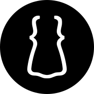

# dress.css

## v5.0.0

The little dress of CSS.

[Site](https://remino.net/dress.css/) |
[Code Repo](https://github.com/remino/dress.css) |
[NPM Package](https://www.npmjs.com/package/@remino/dress.css)

By Rémino Rem <https://remino.net/>

---

## Minimal style for semantic HTML

**<mark>dress.css</mark>** is a minimalist class-less stylesheet that makes your
pages look great simply by writing HTML. Inspired by
[_new.css_](https://newcss.net/) but tailored with a custom vertical rhythm and
no external fonts, it delivers modern typography, spacing, and interactive
states out of the box. Earlier releases were known as **sem.css**.

---

## Features

- **Small** – roughly 5 KiB gzipped.
- **Class-less** – semantic HTML gets styled automatically.
- **Modern** – built with native CSS nesting, custom properties, and flexbox.
- **Readable** – carefully tuned typography and spacing.
- **Responsive** – relative units everywhere, zero media-query fuss.
- **Accessible** – friendly focus states and thoughtful defaults.
- **Printable** – attractive print layout with external URLs revealed.
- **Customizable** – override the CSS variables to theme it your way.
- **Ready-made themes** – drop-in CSS overrides for Aurora, Nocturne, and Sage.

---

## Installation

### HTML (CDN)

<!-- prettier-ignore -->
```html
<link rel="stylesheet" href="https://unpkg.com/@remino/dress.css/dist/dress.css">
```

Mirrors:

- https://unpkg.com/@remino/dress.css/dist/dress.css
- https://cdn.jsdelivr.net/npm/@remino/dress.css/dist/dress.css

### npm

```bash
npm install @remino/dress.css
```

Use `node_modules/@remino/dress.css/dist/dress.css` in your build pipeline.

### Direct download

Grab the latest `dress.css` from the
[GitHub Releases](https://github.com/remino/dress.css/releases/latest/download/dress.css).

---

## Usage

Reference the [_Elements_](https://remino.net/dress.css/elements/) page for
tag-by-tag examples that demonstrate the provided defaults.

---

## Browser support

Designed for evergreen browsers (current Chrome, Edge, Firefox, Safari, and
their mobile counterparts). Compatibility is periodically checked with
[`doiuse`](https://www.npmjs.com/package/doiuse); older engines such as IE are
not supported.

---

## Development

This project is built with Vite (for the CSS library) and Astro (for the
documentation site).

```bash
npm install
npm run dev        # Start the Astro dev server
npm run build:css  # Build dist/dress.css
npm run build:site # Build the documentation site to deploy/public/
npm run build      # Run both builds
```

### Publishing the static site

Deploy artifacts live in `deploy/public/` (docs) and `deploy/nginx/`.

```bash
npm run worktree:init   # create a deploy/ worktree on an orphan branch
npm run publish:site    # rebuild + git add/commit inside deploy/
(cd deploy && git push origin deploy)
```

---

## Tests

### Visual regression (Playwright)

```bash
npm run test
npm run test:update
```

Snapshots cover the Elements gallery, layout width fixtures, and anchor
behavior.

---

## Contributing

1. Fork the repository.
2. Create a feature branch: `git checkout -b feature/amazing-feature`.
3. Make your changes.
4. Run `npm run build` and `npm test`.
5. Commit, push, and open a pull request.

Issues and ideas are welcome—please star the project if you enjoy it!

---

## Licence

Licensed under the ISC licence. See `LICENSE.md`.
